# 🚀 Ansible WordPress Production Deployment

Automated **production-ready WordPress deployment using Ansible**.

This project provisions a complete **LEMP stack** including **Nginx, PHP-FPM, MySQL, and WordPress** using **Infrastructure as Code (IaC)** principles.

The goal of this project is to demonstrate **DevOps automation skills using Ansible roles, modular playbooks, and repeatable infrastructure deployment**.

---

# 🏗 Basic WordPress Hosting Architecture in AWS


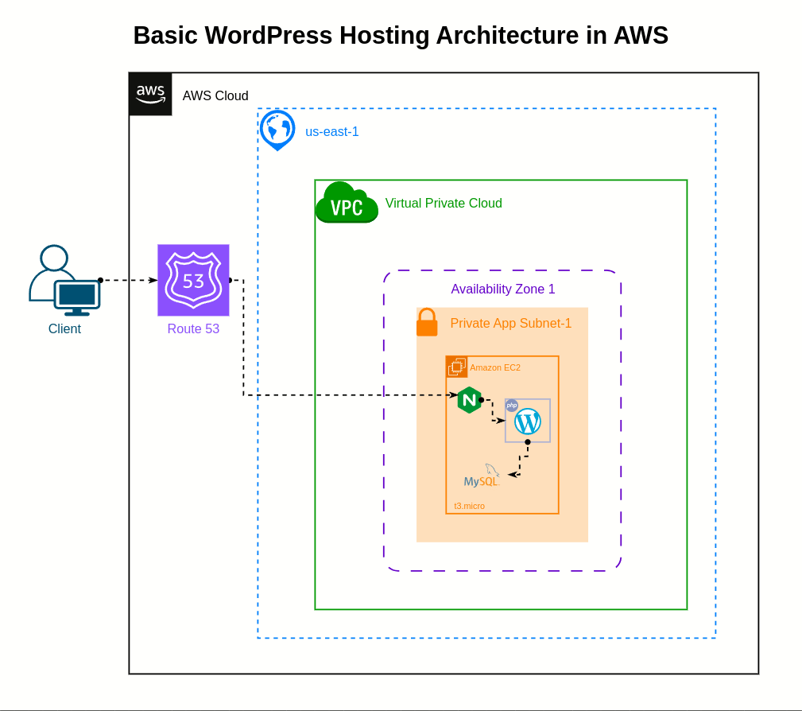


---
# 🏗 High Availability WordPress Hosting Architecture on AWS


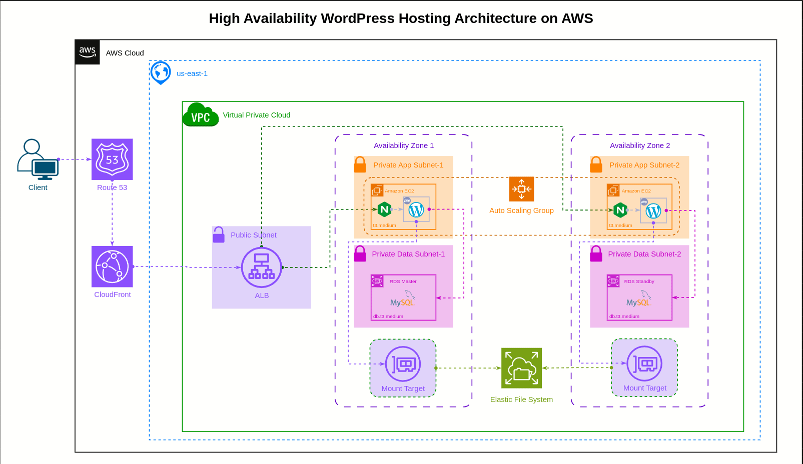

---
# 🏗 Secure High Availability Multi-Region WordPress Hosting Architecture on AWS


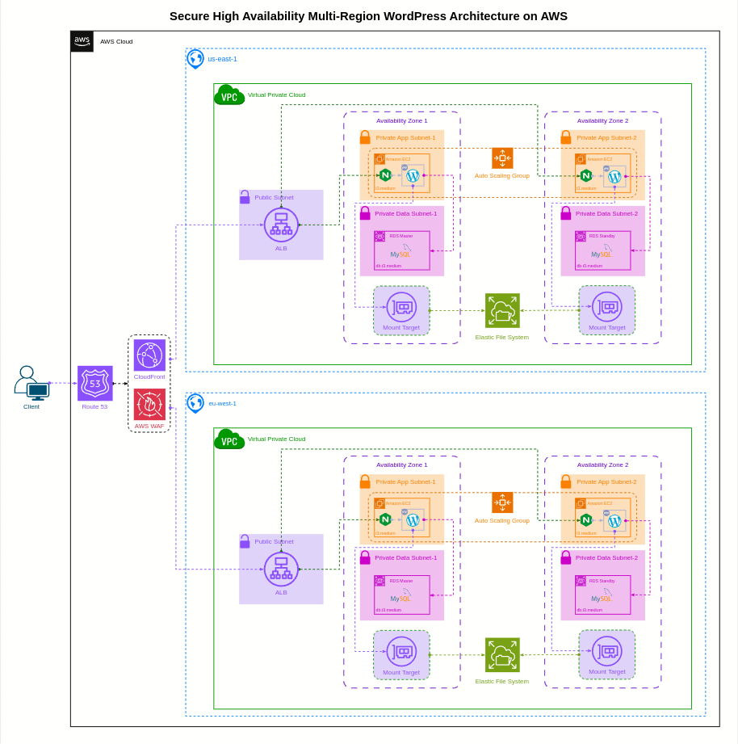

---
# ⚙️ Tech Stack

| Component      | Technology           |
| -------------- | -------------------- |
| Automation     | Ansible              |
| Web Server     | Nginx                |
| Application    | WordPress            |
| Database       | MySQL                |
| Runtime        | PHP-FPM              |
| OS Support     | Ubuntu / Debian      |
| Infrastructure | EC2 / VPS / Cloud VM |

---

# 📂 Project Structure

```
ansible-wordpress-deployment
│
├── inventory
│   └── hosts.ini
│
├── group_vars
│   └── all.yml
│
├── roles
│   ├── common
│   │   └── tasks
│   │
│   ├── security
│   │   └── tasks
│   │
│   ├── mysql
│   │   └── tasks
│   │
│   ├── php
│   │   └── tasks
│   │
│   ├── wordpress
│   │   └── tasks
│   │
│   ├── nginx
│   │   ├── tasks
│   │   └── templates
│   │
│   └── ssl
│       └── tasks
│
├── playbook.yml
└── README.md
```

---

# 🚀 Features

✔ Automated **WordPress deployment**

✔ **Nginx web server configuration**

✔ **PHP-FPM runtime setup**

✔ **MySQL database provisioning**

✔ **WordPress database and user creation**

✔ **Role-based Ansible architecture**

✔ Ready for **cloud deployment (EC2 / VPS / Cloud VM)**

---

# 🖥 Supported Infrastructure

This playbook can deploy WordPress on:

* AWS EC2
* DigitalOcean Droplets
* Google Cloud Compute Engine
* Azure Virtual Machines
* Any **Ubuntu/Debian VPS**

---

# 📦 Configure Inventory

Edit the `inventory/hosts.ini` file with your server details.

Example:

```
[wordpress]
wordpress-server ansible_host=SERVER_IP ansible_user=ubuntu ansible_ssh_private_key_file=~/.ssh/id_rsa
```

Example for EC2:

```
[wordpress]
wordpress-server ansible_host=54.210.xx.xx ansible_user=ubuntu ansible_ssh_private_key_file=~/.ssh/aws-key.pem
```

---

# ▶️ Run the Playbook

Deploy the complete WordPress stack:

```
ansible-playbook playbook.yml
```

This playbook will automatically install and configure:

* Nginx
* PHP-FPM
* MySQL
* WordPress

---

# 🔍 Verify Installation

After deployment, open your browser:

```
http://<server-ip>
```

You should see the **WordPress installation page**.

---

# 🔐 Security Best Practices

This project implements several best practices:

* Dedicated **database user**
* **Service separation** (Nginx + PHP-FPM)
* Proper **file permissions**
* **Idempotent configuration management**
* Role-based **Ansible architecture**

---

# 📊 Automation Workflow

```
Provision Server
       │
       ▼
Install System Packages
       │
       ▼
Configure MySQL Database
       │
       ▼
Install PHP-FPM
       │
       ▼
Deploy WordPress
       │
       ▼
Configure Nginx
       │
       ▼
Start Services
```

---

## 📸 Screenshots

<p align="center">
  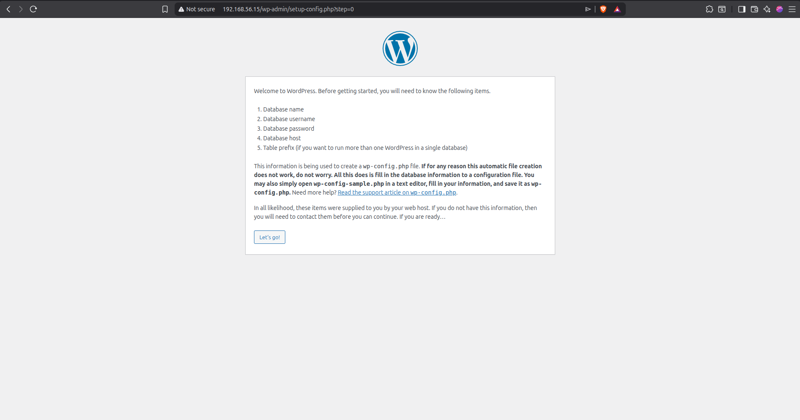
  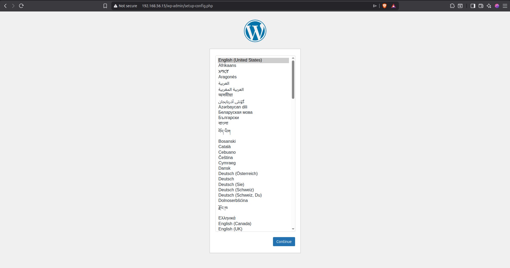
  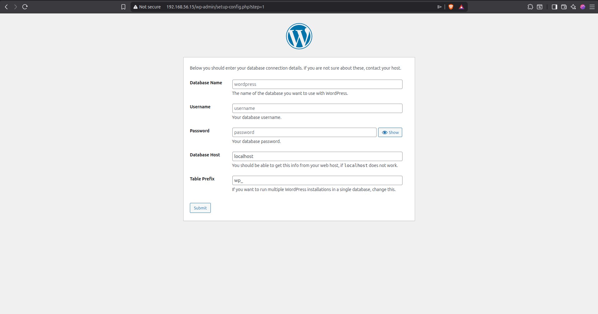
</p>

<p align="center">
  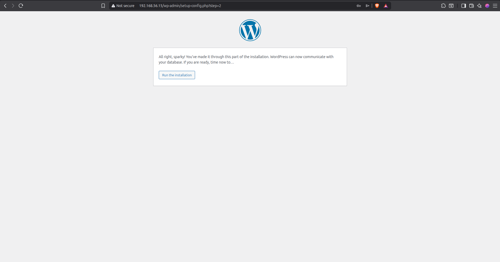
  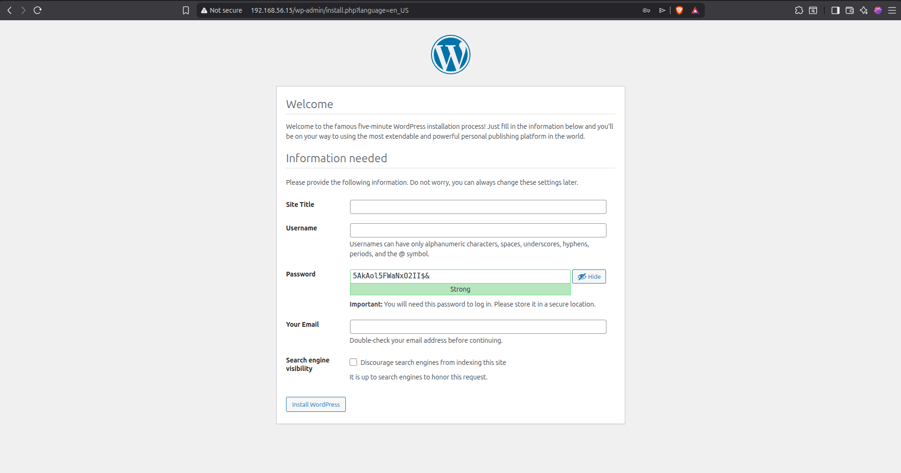
  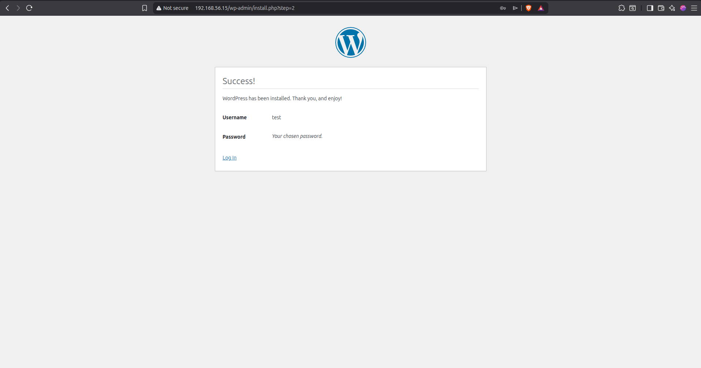
</p>

<p align="center">
  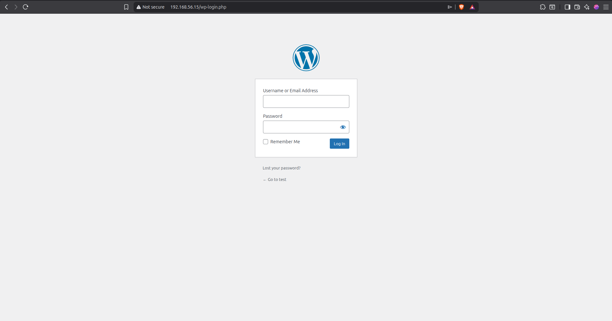
  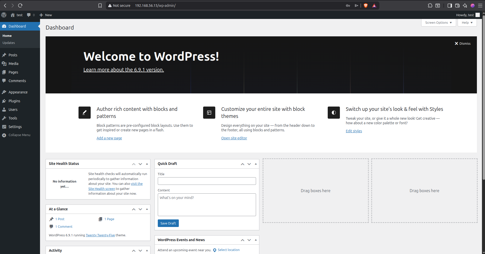
  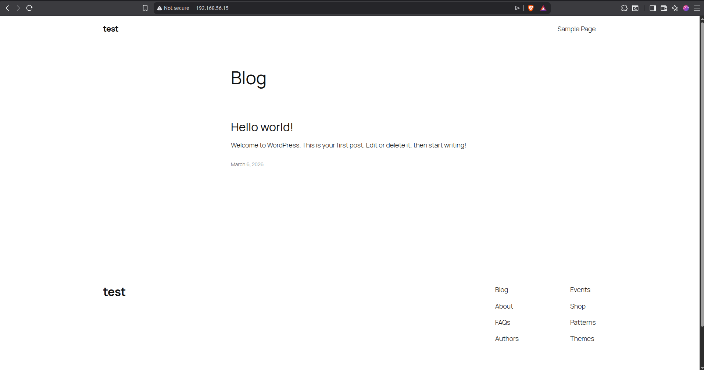
</p>

---

# 📚 Learning Outcomes

This project demonstrates practical experience with:

* **Ansible configuration management**
* **Infrastructure as Code (IaC)**
* Automated **LEMP stack deployment**
* Modular **Ansible roles architecture**
* Cloud-ready **infrastructure automation**

---

## ⭐ Support

If you find this project helpful, please give it a star ⭐ on GitHub.

---

## 🌐 Connect With Me

<div align="center">
  
[](https://www.linkedin.com/in/shaikh-muhammad-ajaz)
[](mailto:shaikhajaz38000@gmail.com)
[](https://www.youtube.com/@devopswithajaz)
</div>

<div align="center">

[](https://upwork.com/freelancers/muhammadajaz)
[](https://www.fiverr.com/ajazshaikh3800)
</div>

---

<div align="center">
  
### 💡 "Turning ideas into production-ready systems."


[](https://github.com/Ajaz3800)

</div>
